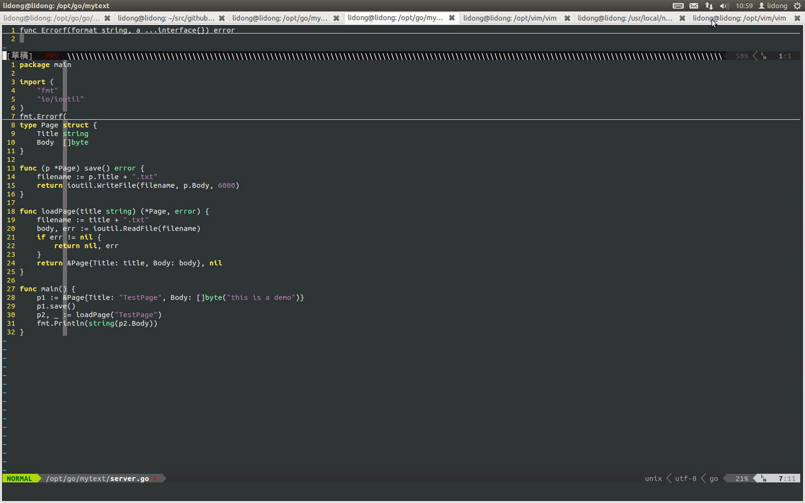

vim
===

```go```
>终端
>><pre>
export GOROOT=/usr/local/go
export GOPATH=/data/app/gopath
export PATH=$PATH:$GOROOT/bin:$GOPATH/bin
</pre>

>vim vundle
>><pre>
git clone https://github.com/gmarik/vundle.git ~/.vim/bundle/vundle
</pre>
>><pre>
set nocompatible 
filetype off 
set rtp+=/home/lidong/.vim/bundle/vundle/
call vundle#rc()
Bundle 'gmarik/vundle'
filetype plugin indent on
syntax on
</pre>

>vim gocode
>><pre>
go get -u github.com/nsf/gocode
<pre>
>><pre>
if exists("g:did_load_filetypes")
    filetype off 
    filetype plugin indent off 
    endif
set runtimepath+=/opt/go/go/misc/vim
Bundle 'Blackrush/vim-gocode'
filetype plugin indent on
syntax on
autocmd FileType go autocmd BufWritePre <buffer> Fmt
filetype plugin on
</pre>

>Last
>><pre>
:PluginInstall
使用<C-x><C-o>
</pre>


vimrc
